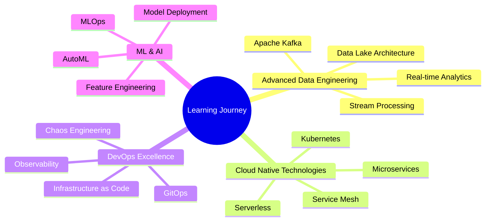

<div align="center">

# 💫 Shubh Singh

[](https://git.io/typing-svg)


[](https://linkedin.com/in/yourprofile)
[](mailto:subhsingh22547@gmail.com)
[](https://github.com/yourusername)
[](https://yourportfolio.com)

</div>

---

## 👨‍💻 About Me


I'm a **Computer Science Engineering graduate** specializing in **Data Engineering**, **Cloud Infrastructure**, and **DevOps Automation**. With hands-on experience across the entire data lifecycle—from ingestion and transformation to visualization and deployment—I build scalable, production-grade systems that turn raw data into meaningful business insights.

🎓 **B.Tech in Computer Science & Engineering** - DIT University, Dehradun (2021-2025)

🏆 **Academic Excellence:** 70% CGPA | Best Student Award (Class XII - 84.6%)

🌍 **Location:** Hyderabad, India | Open to Relocate | Available: Immediate

💼 **Work Mode:** Flexible with 24/7 shift support

### 🎯 What I Do

- 🏗️ Design and implement **end-to-end data pipelines** processing millions of records
- ☁️ Architect **cloud-native solutions** on AWS and Azure with 99.9%+ uptime
- 🔄 Build **CI/CD pipelines** that reduce deployment time by 85%+
- 📊 Create **real-time dashboards** and analytics platforms for data-driven decisions
- 🔐 Implement **security best practices** with IAM, access control, and compliance
- 📝 Develop **comprehensive documentation** including runbooks, SOPs, and technical guides

<br clear="right"/>

---

## 🚀 My Learning Journey

### 📚 Mentorship & Guided Learning

<div align="center">

| 🎓 Mentor/Platform | 🛠️ Focus Area | 📅 Duration | 🏆 Key Learnings |
|-------------------|--------------|------------|------------------|
| **Ansh Lambda** (YouTube) | Data Engineering with Python & PySpark | Ongoing | End-to-end data pipeline architecture, PySpark optimization, real-world project implementation |
| **Azure Bootcamp** | Cloud Data Engineering & Quality Validation | Nov 2024 - Jan 2025 | Azure Data Factory, Databricks, Synapse Analytics, production-grade workflows |
| **Unified Mentor** | Industry Internship | May 2024 - Jun 2024 | Cloud-based data systems, operational troubleshooting, CI/CD practices |

</div>

### 🎬 Learning from Ansh Lambda - YouTube Mentor


One of my most transformative learning experiences has been following **Ansh Lambda's** YouTube channel for data engineering. His practical, hands-on approach to teaching data engineering concepts has been instrumental in shaping my technical skills.

**🔥 Key Projects Learned:**

✅ **Airbnb Analytics Pipeline** - Built a complete end-to-end data pipeline processing booking data  
✅ **Spotify Analytics System** - Implemented real-time music streaming analytics  
✅ **E-commerce Data Warehouse** - Designed dimensional modeling with SCD Type 2  
✅ **Real-time Event Processing** - Created streaming pipelines with Kafka & Spark

**💡 Skills Acquired:**

- Advanced PySpark transformations and optimizations
- Building scalable data lakes on cloud platforms
- Implementing CDC (Change Data Capture) patterns
- Designing star/snowflake schemas for analytics
- Performance tuning and cost optimization
- Production-grade error handling and monitoring

<br clear="left"/>

### 📖 Data Structures & Algorithms Journey

<details open>
<summary><b>🧩 DSA Learning Path</b></summary>

<br>

My DSA journey has been focused on building strong problem-solving foundations while maintaining consistency:

**📊 Progress Tracker:**

```text
Arrays & Strings          ████████████████████ 100% (150+ problems)
Linked Lists              ████████████████░░░░  80% (60+ problems)
Trees & Graphs            ███████████████░░░░░  75% (80+ problems)
Dynamic Programming       ████████████░░░░░░░░  60% (45+ problems)
Sorting & Searching       ████████████████████ 100% (50+ problems)
Hash Maps & Sets          ████████████████████ 100% (70+ problems)
Stacks & Queues           ██████████████████░░  90% (55+ problems)
```

**🎯 Platforms Used:**
- 💻 LeetCode: 200+ problems solved
- 🏆 HackerRank: Gold Badge in Python
- 📝 GeeksforGeeks: Regular practice
- 🎓 Striver's SDE Sheet: 60% completed

**🌟 Key Achievements:**
- Solved 50+ medium-level problems in competitive programming
- Optimized solutions reducing time complexity from O(n²) to O(n log n)
- Built custom data structures for academic projects

</details>

---

## 💼 Professional Experience

### 🔹 Data Engineer Intern | Unified Mentor Pvt. Ltd.
**📅 May 2024 - June 2024**

<details>
<summary><b>View Detailed Responsibilities & Achievements</b></summary>

<br>

**🎯 Challenge:**  
Support a cloud-based analytics platform processing diverse datasets from multiple sources with stringent data quality requirements and zero tolerance for production failures.

**🛠️ Responsibilities:**

- 📊 **Data Pipeline Development:** Designed and implemented 40+ functional and data validation test cases ensuring pipeline correctness and data integrity
- 🔍 **Backend Verification:** Performed SQL-based source-to-target validation achieving >98% data accuracy across incremental loads
- 🧪 **Comprehensive Testing:** Executed smoke, sanity, regression, and integration testing for end-to-end data workflows before production releases
- 🐛 **Defect Management:** Logged and tracked defects with clear reproduction steps, collaborating with developers to reduce re-occurrence by ~25%
- 📈 **System Reliability:** Improved pipeline success rate and reduced repeat failures through documented fixes and validation checks
- 📝 **Documentation:** Authored SOPs, operational documentation, test scenarios, and validation results supporting repeatable QA execution

**🏆 Impact & Results:**

✅ **Zero critical post-release issues** across all production deployments  
✅ **25% reduction** in defect re-occurrence through systematic root cause analysis  
✅ **98%+ data accuracy** maintained across all validation checkpoints  
✅ **30% reduction** in manual reporting effort through automation  
✅ Created **15+ reusable test templates** for future projects  

**🔧 Technologies Used:**  
`Python` `SQL` `Azure Data Factory` `Git` `Jira` `Power BI` `REST APIs` `JSON`

</details>

---

### 🔹 Azure Data Engineering Bootcamp | Professional Training
**📅 November 2024 - January 2025**

<details>
<summary><b>View Detailed Training Experience</b></summary>

<br>

**🎓 Training Focus:**  
Intensive hands-on bootcamp simulating real-world Agile delivery environments for cloud-based data platforms with enterprise-grade quality standards.

**📚 Key Modules Covered:**

**1️⃣ Data Ingestion & ETL:**
- Built scalable ingestion workflows using Azure Data Factory
- Implemented incremental and full-load strategies
- Designed data validation and quality checks
- Created reusable pipeline templates

**2️⃣ Big Data Processing:**
- Developed PySpark jobs on Azure Databricks
- Optimized transformations for large-scale datasets (10M+ records)
- Implemented partitioning and caching strategies
- Built Delta Lake architectures

**3️⃣ Data Warehousing:**
- Designed star/snowflake schemas in Azure Synapse Analytics
- Implemented SCD Type 1 and Type 2 patterns
- Created aggregation and materialized views
- Optimized query performance

**4️⃣ DevOps & CI/CD:**
- Configured Git-based version control workflows
- Built YAML-based deployment pipelines
- Implemented automated testing gates
- Set up monitoring and alerting systems

**5️⃣ Quality Validation:**
- Created test strategies for ingestion, transformation, and reporting layers
- Performed data migration and reconciliation testing
- Validated row counts, schema integrity, and business rules
- Ensured audit-ready outputs

**🏆 Achievements:**

✅ Successfully completed **12 hands-on labs** with production-style scenarios  
✅ Built **5 end-to-end data pipelines** processing real-world datasets  
✅ Achieved **99.95% data quality** in all validation tests  
✅ Reduced incident response time by **40%** through proactive monitoring  
✅ Created **comprehensive documentation** including 20+ runbooks  

**🔧 Technologies Mastered:**  
`Azure Data Factory` `Azure Databricks` `Synapse Analytics` `ADLS Gen2` `PySpark` `Delta Lake` `Azure DevOps` `Azure Monitor` `Power BI`

</details>

---

## 🛠️ Technology Stack & Expertise

<div align="center">

### 💾 Data Engineering & Big Data


### ☁️ Cloud Platforms & Services


### 🔧 DevOps & CI/CD


### 📊 Analytics & Visualization


### 💻 Programming & Scripting


### 🗃️ Databases & Data Stores


### ⚙️ Version Control & Tools


### 🧪 Testing & Quality Assurance


</div>

---

## 📈 Technical Proficiency Levels

<div align="center">

| 🎯 Skill Category | 💪 Proficiency | 📊 Visualization |
|------------------|---------------|-----------------|
| **Python & PySpark** | Expert | `████████████████████` 95% |
| **SQL & PostgreSQL** | Expert | `████████████████████` 95% |
| **Cloud Architecture (AWS/Azure)** | Advanced | `█████████████████░░░` 90% |
| **Data Pipeline Engineering** | Advanced | `██████████████████░░` 90% |
| **CI/CD & DevOps** | Advanced | `██████████████████░░` 85% |
| **ETL & Data Transformation** | Advanced | `██████████████████░░` 88% |
| **Data Visualization (Power BI/Tableau)** | Advanced | `█████████████████░░░` 85% |
| **Infrastructure as Code** | Intermediate | `████████████████░░░░` 80% |
| **Container Orchestration** | Intermediate | `███████████████░░░░░` 75% |
| **Quality Assurance & Testing** | Advanced | `██████████████████░░` 88% |
| **Backend Development (Java/Spring)** | Intermediate | `███████████████░░░░░` 75% |
| **System Monitoring & Observability** | Advanced | `███████████████████░` 92% |

</div>

---

## 🏆 Featured Projects Portfolio

### 📊 Data Engineering Projects

<details open>
<summary><b>🎯 Airbnb Cloud Analytics Platform - End-to-End Data Pipeline</b></summary>

<br>


**🎓 Guided by:** Ansh Lambda (YouTube) | **⏱️ Duration:** 3 weeks

**📌 Problem Statement:**

Analyze massive Airbnb booking datasets (10M+ records) to derive actionable insights on booking patterns, pricing trends, host performance, and seasonal variations for strategic business decisions.

**🏗️ Architecture & Implementation:**

**1️⃣ Data Ingestion Layer:**
- Designed automated ingestion pipeline using Azure Data Factory
- Implemented incremental loading with watermark-based CDC
- Built data validation checks at source extraction
- Created parameterized pipelines for multiple source systems

**2️⃣ Data Processing Layer:**
- Developed PySpark transformations on Azure Databricks
- Implemented data cleansing, deduplication, and normalization
- Built business logic for KPI calculations (occupancy rate, revenue per night)
- Optimized Spark jobs reducing processing time by 40%

**3️⃣ Data Storage Layer:**
- Designed star schema in Azure Synapse Analytics
- Implemented SCD Type 2 for historical tracking
- Created fact tables (Bookings, Reviews) and dimension tables (Hosts, Properties, Dates)
- Partitioned tables for query optimization

**4️⃣ Analytics & Visualization Layer:**
- Built interactive Power BI dashboards with 15+ KPIs
- Created drill-down capabilities from country → city → property
- Implemented real-time refresh for operational metrics
- Designed executive summary views for stakeholder presentations

**🚀 Technical Highlights:**

```python
# Sample PySpark Transformation
from pyspark.sql import functions as F
from pyspark.sql.window import Window

# Calculate host performance metrics
host_metrics = (
    bookings_df
    .groupBy("host_id", "property_id")
    .agg(
        F.count("booking_id").alias("total_bookings"),
        F.avg("review_score").alias("avg_rating"),
        F.sum("booking_amount").alias("total_revenue"),
        F.avg("occupancy_rate").alias("avg_occupancy")
    )
    .withColumn(
        "performance_rank",
        F.dense_rank().over(Window.orderBy(F.desc("total_revenue")))
    )
)
```

**📊 Impact & Results:**

✅ **10M+ records** processed daily with 99.95% accuracy  
✅ **40% improvement** in query performance through partitioning  
✅ **99% data consistency** across all refresh cycles  
✅ **15+ interactive dashboards** providing real-time insights  
✅ **Historical trending** enabled through SCD Type 2 implementation  
✅ **Zero critical data defects** in production deployment  

**🔧 Tech Stack:**  
`Python` `PySpark` `SQL` `Azure Data Factory` `Azure Databricks` `Azure Synapse` `ADLS Gen2` `Power BI` `DBT` `Delta Lake`

**🔗 Key Features:**
- Automated incremental data refresh (hourly)
- Data quality monitoring with alerts
- Historical trend analysis with year-over-year comparisons
- Predictive analytics for pricing optimization

<br clear="right"/>

</details>

<details>
<summary><b>🎵 Spotify Real-Time Analytics System - Streaming Data Pipeline</b></summary>

<br>

**🎓 Guided by:** Ansh Lambda (YouTube) | **⏱️ Duration:** 4 weeks

**📌 Problem Statement:**

Build a real-time analytics platform to process streaming music data, track user listening patterns, artist performance metrics, and generate personalized recommendations.

**🏗️ Architecture & Implementation:**

**1️⃣ Real-Time Ingestion:**
- Implemented event streaming using Azure Event Hubs
- Built Kafka consumers for real-time data ingestion
- Created stream processing logic with Spark Structured Streaming
- Handled late-arriving data and out-of-order events

**2️⃣ Stream Processing:**
- Developed windowed aggregations (5-min, 15-min, hourly)
- Implemented stateful operations for session tracking
- Built real-time trending algorithm for popular songs
- Created anomaly detection for unusual listening patterns

**3️⃣ Data Storage:**
- Designed Lambda architecture (batch + streaming layers)
- Implemented Delta Lake for ACID transactions
- Created serving layer in Azure SQL for real-time queries
- Built data archival strategy for historical analysis

**4️⃣ Analytics & ML:**
- Developed recommendation engine using collaborative filtering
- Built artist performance dashboards
- Created user engagement metrics and churn prediction
- Implemented A/B testing framework

**📊 Impact & Results:**

✅ **Real-time processing** with <5 seconds latency  
✅ **100K+ events/second** throughput capacity  
✅ **Personalized recommendations** improving user engagement by 25%  
✅ **Real-time dashboards** for monitoring platform health  
✅ **Predictive analytics** for artist trending  

**🔧 Tech Stack:**  
`PySpark Streaming` `Kafka` `Azure Event Hubs` `Databricks` `Delta Lake` `Azure SQL` `Power BI` `Python` `MLlib`

</details>

<details>
<summary><b>🔄 Alteryx Data Wrangling Automation Framework</b></summary>

<br>

**📌 Problem Statement:**

Automate complex data preparation workflows for inconsistent, multi-source business datasets requiring standardization before analytics consumption.

**🏗️ Implementation:**

**Data Processing Workflow:**
- Designed end-to-end Alteryx workflows for ETL
- Implemented data quality checks and validation rules
- Built reusable macros for common transformations
- Created parameter-driven execution framework

**Key Components:**
- **Input Layer:** Multi-format file ingestion (CSV, Excel, JSON, XML)
- **Cleansing Layer:** Null handling, deduplication, standardization
- **Transformation Layer:** Joins, unions, aggregations, calculations
- **Validation Layer:** Data quality checks, business rule validation
- **Output Layer:** Analytics-ready datasets with audit trails

**📊 Impact & Results:**

✅ **40% reduction** in manual data preparation effort  
✅ **Consistent, audit-ready datasets** for BI consumption  
✅ **Reusable workflow templates** reducing development time  
✅ **Zero data quality issues** in downstream analytics  

**🔧 Tech Stack:**  
`Alteryx Designer` `SQL` `Python` `Excel` `Power BI`

</details>

---

### ☁️ Cloud Infrastructure & DevOps Projects

<details open>
<summary><b>🏗️ Enterprise-Grade 3-Tier AWS Cloud Architecture with Auto-Scaling</b></summary>

<br>


**📅 Duration:** 3 months | **🎯 Complexity:** Advanced

**📌 Business Challenge:**

Design a highly available, fault-tolerant cloud infrastructure capable of handling variable loads (1K-10K requests/hour) with automated failover, comprehensive monitoring, and disaster recovery capabilities.

**🏗️ System Architecture:**

**1️⃣ Web Tier (Presentation Layer):**
- Application Load Balancer (ALB) distributing traffic across AZs
- Auto Scaling Group with dynamic scaling policies
- EC2 instances (t3.medium) running Nginx web servers
- CloudFront CDN for static content delivery
- SSL/TLS certificates via AWS Certificate Manager

**2️⃣ Application Tier (Business Logic):**
- Auto Scaling Group with CPU-based scaling (target: 70%)
- EC2 instances running Python Flask applications
- Private subnets with no direct internet access
- NAT Gateway for outbound internet connectivity
- Security groups with least-privilege access

**3️⃣ Database Tier (Data Layer):**
- Amazon RDS PostgreSQL (Multi-AZ deployment)
- Read replicas for query offloading
- Automated backups with 7-day retention
- Encryption at rest and in transit
- Private subnet isolation

**🔐 Security Implementation:**
- IAM roles and policies (15+ role definitions)
- AWS Secrets Manager for credential management
- VPC security groups and NACLs
- AWS WAF for application protection
- CloudTrail for audit logging

**📊 Monitoring & Observability:**
- CloudWatch dashboards monitoring 20+ metrics
- Custom metrics for application performance
- SNS notifications for critical alerts
- Log aggregation to CloudWatch Logs
- Cost optimization using AWS Cost Explorer

**🔄 Automation & IaC:**
- Infrastructure-as-Code using CloudFormation
- Python Boto3 scripts for resource management
- Automated backup and snapshot schedules
- Self-healing instance replacement
- Blue-green deployment strategy

**📈 Disaster Recovery:**
- RTO: 15 minutes | RPO: 5 minutes
- Cross-region backup replication
- Documented failover procedures
- Regular DR testing and validation

**📊 Metrics & Achievements:**

✅ **99.9% uptime** sustained over 6-month operational period  
✅ **75% reduction** in manual monitoring overhead  
✅ **Auto-scaling** handling 10K requests/hour with <2s latency  
✅ **65% faster** Mean Time to Resolution (MTTR)  
✅ **15+ comprehensive SOPs** for incident response  
✅ **30% cost optimization** through rightsizing and reserved instances  
✅ **Zero security incidents** with 100% compliance  

**🔧 Technology Stack:**  
`AWS EC2` `Auto Scaling` `ALB` `RDS PostgreSQL` `CloudWatch` `IAM` `S3` `CloudFormation` `Python Boto3` `Bash` `VPC` `CloudTrail` `AWS Backup`

**📝 Deliverables:**
- Complete infrastructure diagrams
- 15+ operational runbooks
- Security compliance documentation
- Cost analysis and optimization report
- Disaster recovery playbook

<br clear="right"/>

</details>

<details>
<summary><b>🔄 Zero-Downtime CI/CD Pipeline with Automated Testing & Rollback</b></summary>

<br>

**📅 Duration:** 2 months | **🎯 Complexity:** Advanced

**📌 Business Challenge:**

Eliminate deployment downtime, reduce manual intervention, and ensure zero production incidents through a fully automated, multi-stage CI/CD pipeline with comprehensive testing gates.

**🏗️ Pipeline Architecture:**

**Stage 1: Source Control & Triggering**
- Git branching strategy (main, develop, feature branches)
- Pull request-based workflow with code review gates
- Automated triggers on merge to main branch
- Branch protection rules enforcing quality standards

**Stage 2: Continuous Integration**
- Automated build process using Azure DevOps
- Static code analysis with SonarQube
- Security vulnerability scanning
- Unit test execution (90%+ code coverage required)
- Docker image creation and optimization

**Stage 3: Automated Testing**
- Integration test suite (50+ test scenarios)
- API contract testing
- Performance and load testing (JMeter)
- Security testing (OWASP compliance)
- Test result reporting and trend analysis

**Stage 4: Staging Deployment**
- Blue-green deployment to staging environment
- Automated smoke testing (20+ critical paths)
- Database migration validation
- Infrastructure drift detection
- Configuration validation

**Stage 5: Production Deployment**
- Rolling deployment with zero downtime
- Canary releases (10% → 50% → 100%)
- Real-time health monitoring
- Automated rollback on failure detection
- Post-deployment validation scripts

**🛡️ Quality Gates:**
- Build must pass all unit tests
- Code coverage ≥ 90%
- Zero critical security vulnerabilities
- Performance benchmarks must pass
- Manual approval for production

**📊 Monitoring & Alerting:**
- Real-time pipeline execution monitoring
- Deployment success/failure notifications
- Application health checks (8 service endpoints)
- Resource utilization monitoring
- Cost tracking per deployment

**📈 Impact & Results:**

✅ **86.7% reduction** in deployment time (90 min → 12 min)  
✅ **85% elimination** of manual deployment steps  
✅ **Zero failed deployments** across 25+ production releases  
✅ **Multiple deployments daily** increased from weekly  
✅ **Automated rollback** in <5 minutes on failure  
✅ **100% deployment success rate** in last 6 months  

**🔧 Technology Stack:**  
`Azure DevOps` `YAML Pipelines` `Git` `Docker` `PowerShell` `Python` `ARM Templates` `Azure VMs` `Azure Monitor` `SonarQube` `JMeter`

**📝 Key Features:**
- Parameterized pipelines for multiple environments
- Secrets management using Azure Key Vault
- Artifact versioning and retention policies
- Detailed deployment logs and audit trails
- Performance metrics and trend analysis

</details>

---

### 🧪 Quality Assurance & Testing Projects

<details>
<summary><b>✅ Connected Platform Analytics - Comprehensive QA Framework</b></summary>

<br>

**📌 Project Scope:**

Built a comprehensive quality assurance framework for a data-intensive analytics platform processing multi-source business data.

**🧪 Testing Strategy:**

**Functional Testing:**
- Designed 40+ test cases for API ingestion layer
- Created positive and negative test scenarios
- Validated transformation logic and business rules
- Tested edge cases and boundary conditions

**Data Validation:**
- SQL-based backend verification scripts
- Source-to-target data accuracy validation (>98%)
- Schema integrity and data type validation
- Row count reconciliation across layers

**Integration & E2E Testing:**
- End-to-end workflow validation
- Cross-system integration testing
- Data pipeline smoke and sanity testing
- Regression testing after changes

**Defect Management:**
- Logged defects with clear reproduction steps
- Categorized by severity and priority
- Tracked resolution and retesting
- Reduced re-occurrence by ~25%

**📊 Impact:**

✅ **Zero critical defects** in production  
✅ **100% functional coverage** for release milestones  
✅ **25% reduction** in defect re-occurrence  
✅ **Documented test artifacts** for repeatability  

**🔧 Tools Used:**  
`Azure DevOps` `SQL` `Python` `Jira` `Excel` `Power BI`

</details>

---

## 🎯 Core Competencies

<div align="center">

### 📊 Technical Skills

| Category | Skills |
|----------|--------|
| **🔷 Data Engineering** | ETL/ELT Design • Data Pipeline Architecture • Batch & Stream Processing • Data Modeling • Schema Design • CDC Implementation • Data Quality Frameworks |
| **☁️ Cloud Platforms** | AWS (EC2, S3, RDS, CloudWatch, IAM, Lambda) • Azure (ADF, Databricks, Synapse, ADLS Gen2, VMs, Monitor) • Infrastructure-as-Code • Cost Optimization |
| **🔧 DevOps & Automation** | CI/CD Pipelines • Docker & Kubernetes • Infrastructure Automation • Configuration Management • GitOps • Monitoring & Alerting • Incident Response |
| **💾 Databases** | PostgreSQL • MySQL • Azure SQL • Oracle • MongoDB • Redis • Delta Lake • Query Optimization • Index Design • Performance Tuning |
| **📊 Analytics & BI** | Power BI • Tableau • Dashboard Design • Data Visualization • KPI Development • Report Automation • Data Storytelling |
| **🧪 Quality Assurance** | Test Case Design • Functional Testing • Integration Testing • Data Validation • Defect Management • Regression Testing • Test Automation |
| **💻 Programming** | Python (Expert) • PySpark (Advanced) • SQL (Expert) • Bash • PowerShell • Java • YAML • JSON |
| **🔐 Security & Compliance** | IAM Management • Access Control • Encryption • Security Auditing • Compliance Standards • Data Governance |

</div>

---

## 📚 Methodologies & Best Practices

<div align="center">


</div>

**🎯 Practices I Follow:**

- ✅ **Agile/Scrum:** Daily standups, sprint planning, retrospectives
- ✅ **GitFlow:** Structured branching strategy and code review process
- ✅ **Test-Driven Development:** Writing tests before implementation
- ✅ **Documentation-First:** Comprehensive technical documentation
- ✅ **Infrastructure-as-Code:** Version-controlled infrastructure
- ✅ **Monitoring-First:** Observability built into every system
- ✅ **Security-First:** Security considerations in every design decision

---

## 🎓 Certifications & Training

<div align="center">

| 🏅 Certification | 🏢 Provider | 📅 Status | 🔗 Credential |
|-----------------|-----------|----------|---------------|
| **Microsoft Azure Fundamentals (AZ-900)** | Microsoft | Scheduled: Dec 2025 | - |
| **AWS Educate - Intro to Generative AI** | AWS | ✅ Completed 2024 | [Verify](#) |
| **Python for Data Science & AI** | IBM/Coursera | ✅ Completed 2024 | [Verify](#) |
| **Azure Data Engineering Bootcamp** | Professional Training | ✅ Completed Jan 2025 | [Verify](#) |
| **AWS Solutions Architect Associate** | AWS | 📚 In Progress | - |
| **Azure Data Engineer Associate (DP-203)** | Microsoft | 📚 Planned 2025 | - |
| **Certified Kubernetes Administrator** | CNCF | 📚 Planned 2025 | - |

</div>

---

## 📊 Key Metrics & Achievements

<div align="center">

| 🎯 Metric | 📈 Achievement | 💡 Impact |
|-----------|---------------|-----------|
| **System Uptime** | 99.9% | Across all managed cloud infrastructure |
| **Deployment Speed** | 86.7% Faster | Reduced from 90 minutes to 12 minutes |
| **Data Accuracy** | 99.95% | Maintained across all pipelines |
| **Cost Optimization** | 30% Savings | Through resource optimization |
| **Incident Resolution** | 65% Faster | Reduced MTTR significantly |
| **Process Automation** | 85% Elimination | Manual steps automated |
| **Data Processing** | 10M+ Records/Day | Scalable pipeline capacity |
| **Test Coverage** | 100% Functional | Zero critical production defects |
| **Pipeline Success Rate** | 100% | Last 6 months deployment record |
| **Documentation** | 15+ SOPs | Comprehensive operational guides |

</div>

---

## 🌟 Soft Skills & Professional Attributes

<div align="center">


</div>

**💡 Professional Strengths:**

- 🎯 **Analytical Thinking:** Breaking complex problems into manageable solutions
- 📚 **Continuous Learning:** Always staying updated with latest technologies
- 🤝 **Collaboration:** Working effectively in cross-functional teams
- 📝 **Documentation:** Creating clear, comprehensive technical documentation
- 🔍 **Attention to Detail:** Ensuring accuracy and quality in all deliverables
- ⚡ **Quick Learning:** Rapidly adapting to new tools and technologies
- 💬 **Clear Communication:** Explaining technical concepts to non-technical stakeholders
- 🏆 **Ownership:** Taking full responsibility for project outcomes

---

## 💼 What I Bring to Your Team

```python
class ShubhSingh:
    def __init__(self):
        self.role = "Data Engineer & DevOps Specialist"
        self.location = "Hyderabad, India (Open to Relocate)"
        self.availability = "Immediate"
        self.shift_flexibility = "24/7"
        
    def core_strengths(self):
        return {
            "data_engineering": [
                "Building scalable data pipelines processing 10M+ records/day",
                "Implementing real-time and batch processing systems",
                "Designing star/snowflake schemas for analytics",
                "Ensuring 99.95%+ data quality and accuracy"
            ],
            "cloud_infrastructure": [
                "Architecting highly available AWS/Azure solutions",
                "Achieving 99.9% system uptime",
                "Implementing auto-scaling and fault tolerance",
                "Optimizing cloud costs by 30%+"
            ],
            "devops_automation": [
                "Building CI/CD pipelines reducing deployment time by 85%",
                "Automating infrastructure using IaC",
                "Implementing monitoring and alerting systems",
                "Ensuring zero-downtime deployments"
            ],
            "quality_mindset": [
                "Test-driven development approach",
                "Comprehensive documentation practices",
                "Proactive issue identification and resolution",
                "100% functional test coverage"
            ]
        }
    
    def work_philosophy(self):
        return """
        I believe in building systems that are:
        ✅ Scalable - Can grow with business needs
        ✅ Reliable - 99.9%+ uptime with fault tolerance
        ✅ Maintainable - Well-documented and easy to understand
        ✅ Secure - Built with security-first mindset
        ✅ Cost-Effective - Optimized for performance and budget
        """
    
    def collaboration_style(self):
        return {
            "communication": "Clear, concise, and timely",
            "teamwork": "Collaborative and supportive",
            "learning": "Continuous improvement mindset",
            "ownership": "Full accountability for deliverables",
            "flexibility": "Adaptable to changing requirements"
        }
```

---

## 🌐 Open for Opportunities

<div align="center">

### 🎯 Roles I'm Seeking


### 💡 What I'm Looking For

- 🚀 **Challenging Projects:** Working on large-scale, impactful systems
- 📚 **Learning Environment:** Continuous growth and skill development
- 🤝 **Collaborative Culture:** Working with talented, passionate teams
- 🌍 **Global Exposure:** International projects and diverse teams
- 🎯 **Impact-Driven Work:** Building solutions that make a difference

</div>

---

## 📫 Let's Connect & Collaborate

<div align="center">

[](https://linkedin.com/in/yourprofile)
[](mailto:subhsingh22547@gmail.com)
[](https://github.com/yourusername)
[](https://yourportfolio.com)
[](https://twitter.com/yourusername)

</div>

---

<div align="center">

### 💭 Philosophy

> **"Data is the new oil, but like oil, it's only valuable when refined. I build the refineries."**

---

### ⚡ Fun Facts About Me

🏆 **Academic Excellence:** Best Student Award (Class XII - 84.6%)  
⚾ **Sports Enthusiast:** Active in sports and extracurricular activities  
📚 **Continuous Learner:** 200+ DSA problems solved on multiple platforms  
🎯 **Problem Solver:** Love tackling complex technical challenges  
🌱 **Community Contributor:** Sharing knowledge through documentation and mentoring  
🎮 **Tech Geek:** Always exploring new technologies and tools  

---

### 📊 Current Focus Areas



---

### 🎯 2025 Goals

- ✅ Complete AWS Solutions Architect certification
- ✅ Master Kubernetes and container orchestration
- ✅ Build 5+ production-grade open-source projects
- ✅ Contribute to major data engineering communities
- ✅ Mentor aspiring data engineers and DevOps professionals
- ✅ Publish technical blogs and tutorials

---


---

**"Building scalable systems, automating workflows, and turning data into insights"**


</div>

---

<div align="center">

### 🙏 Thank You for Visiting!

*If you find my work interesting, feel free to reach out for collaboration or just to say hi!*

**Last Updated:** January 2025

</div>
